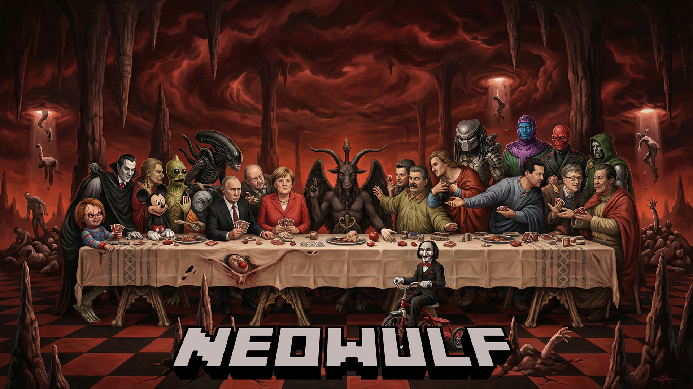

# # # # # # # # # # # # #
# Kodi-Wulf Repository
# # # # # # # # # # # # #

Kodi-Wulf is a static Kodi 21 Omega repository served through GitHub Pages.

## Public URL

    https://kodi-wulf.github.io/repository/

## Installation mit Kodis Datei-Manager

Diese Dateiquelle in Kodis Datei-Manager hinzufügen:

    https://kodi-wulf.github.io/repository/

Danach unter **Add-ons → Aus ZIP-Datei installieren → Kodi-Wulf** installieren:

    repository.kodi-wulf-v1.33.7a.zip

Eine bebilderungsfreundliche Schrittfolge steht auf der Website unter
[`How-To-Use`](https://kodi-wulf.github.io/repository/how-to-use.html).

The same root URL serves the Jekyll website and Kodi's folder browser. The root
page uses React for ZIP-only navigation, Anime.js for restrained transitions,
and one shared dark console theme for all generated directory pages.

After installation, Kodi reads:

    https://kodi-wulf.github.io/repository/addons.xml
    https://kodi-wulf.github.io/repository/addons.xml.md5

## Current repository state

    repository.kodi-wulf 1.33.7a
    sichtbarer Name: Kodi-Wulf
    Kodi target: Kodi 21 Omega
    Add-ons in addons.xml: werden durch tools/build.py erzeugt

## Published structure

    repository.kodi-wulf-v*.zip  Only ZIP allowed in the root
    repository/<addon.id>/     Repository ZIPs
    plugins/<type>/<addon.id>/ Plugin ZIPs, for example plugins/audio/
    script/<type>/<addon.id>/  Script ZIPs, for example script/module/
    incoming/*.zip             Optional temporary import inbox
    addons.xml     Kodi repository metadata
    addons.xml.md5 Kodi repository checksum
    index.html     GitHub Pages landing page

## Local source ZIP layout

Neue ZIPs werden in `zips/` abgelegt. `tools/build.py` liest `addon.xml`,
verschiebt jedes Paket in die kanonische Kategorie, aktualisiert die Kodi-
Metadaten und entfernt den anschließend leeren Importordner. Inhaltsgleiche
Dubletten werden außerhalb der veröffentlichten Struktur archiviert.

## Rebuild

    python tools/build.py --apply

The active generator also runs:

    tools/kodiwulf_addons_xml.py
    tools/kodiwulf_dark_index.py

Only install Kodi add-ons and repositories you trust.
